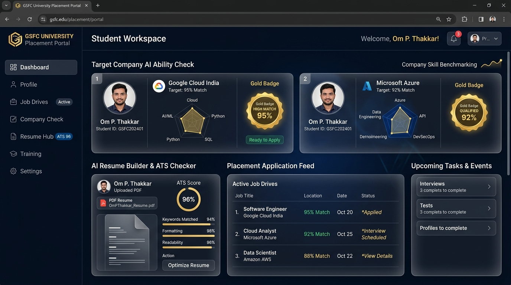
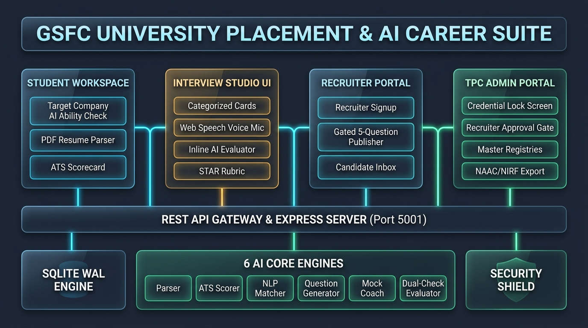

# 🎓 GSFC University Placement Portal & AI Career Suite

> **An Enterprise-Grade Campus Recruitment & AI Evaluation Suite built for GSFC University.**  
> Features automated PDF resume parsing, Target Company AI ability benchmarking, Web Speech API interview coaching, recruiter requirement gating, and TPC Admin governance with NAAC/NIRF accreditation reports.

---

## 📸 System UI & Architecture Showcase

### 1. Student Workspace & Target Company AI Ability Checker


### 2. Full-Stack System Architecture Blueprint


---

## ✨ Key Feature Modules

### 👨‍🎓 1. Student Workspace
* **Target Company AI Ability Check**: Select target recruiting drives (*Google Cloud India*, *Microsoft Azure*, *TCS*) from a dropdown to compute candidate skill gaps, CGPA eligibility cutoffs, and matched competencies in real-time.
* **PDF Resume Parser & ATS Scorer**: Drag-and-drop PDF parser extracting candidate name, contact details, skills density, projects, and computing a 100-point ATS Score.
* **Live Placement Drives Feed**: Interactive drive cards displaying CTC packages, minimum CGPA cutoffs, application deadlines, and internal/external application options.

### 🎙️ 2. Interview Studio & AI Evaluation Agent
* **Categorized Question Cards**: Practice Technical, System Design, Behavioral, and HR-Culture questions framed around student project tech stacks and recruiter question banks.
* **Web Speech API Voice Microphone**: Practice typing or speaking candidate answers directly into the browser with live speech-to-text transcript generation.
* **AI Evaluation Engine**: Evaluates candidate answers against STAR framework rubrics, providing instant Pass/Fail verdicts, clarity ratings, and concept coverage checklists.

### 🏢 3. Recruiter Portal
* **Gated Requirement Publisher**: Recruiter interface enforcing a **5-question bank publishing rule** before placement drives go live.
* **Candidate Leaderboard**: Sorted applicant inbox ranking candidate submissions by AI Match Score %, CGPA, and resume suitability.
* **Status Updates**: One-click recruiter status updates (*Selected for Placement Rounds*, *Shortlisted*, *Pending Review*).

### 🛡️ 4. TPC Admin Portal
* **Credential Authentication Guard**: Lock screen protecting admin analytics behind authorized TPC credentials (`admin@gsfcuniversity.ac.in` / `password123`).
* **Corporate Recruiter Verification Gate**: Approve or reject corporate signup requests before company placement drives appear in the student UI (`c.approved = 1`).
* **360° Master Governance Registries**: View all registered company profiles, active placement drives, and candidate application master feeds.
* **NAAC/NIRF Accreditation CSV Export**: One-click export downloading complete, audited placement conversion metrics for university accreditation audits.

### 🎓 5. Alumni Network & Mentorship Knowledge Hub
* **Verified Alumni Profiles**: Graduated GSFC alumni register with verified company affiliations (e.g. *Amazon AWS*, *GSFC Ltd*, *Reliance Jio*).
* **Mentorship Feed**: Alumni share placement roadmaps, interview playbooks, and company-specific preparation strategies.
* **Interactive Community Discussions**: Students ask questions directly under alumni posts with real-time comments.
* **TPC Verification Gate**: Admin queue to authenticate alumni credentials before granting mentor publishing privileges.

### 🎪 6. Multi-Employer Job Fairs & Conclave Management
* **Pooled Campus Recruitment Drives**: Schedule and manage mega on-campus, hybrid, and virtual career conclaves.
* **Multi-Company Attachments**: Attach multiple active corporate hiring drives to a single job fair event.
* **1-Click Student Registration**: Students broadcast ATS-verified resumes to all participating corporate panels simultaneously.

### 🔮 7. AI/ML Predictive Recruitment Analytics & Early-Warning Interventions
* **Department-Wise Conversion Forecasts**: Predictive models projecting final placement rates per engineering & management branch with analytical reasoning.
* **Salary Trajectory Trends**: Projected cohort average CTC growth and industry benchmark comparisons.
* **Early-Warning At-Risk Roster**: Automatic detection of students with 0 applications or low ATS scores with 1-click WhatsApp/Email counseling alerts.

### 💬 8. Open Community Placement Q&A & Doubt Clarification
* **Categorized Placement Discussions**: Threaded doubts across drive rules, backlog eligibility, and interview technical rounds.
* **Official TPO & Alumni Badges**: Verified answers highlighted with prominent institutional authority badges.
* **Resolution Workflow**: TPO officers and thread authors can mark questions as officially resolved.

---

## 🛠️ Technology Stack

| Layer | Technology |
| :--- | :--- |
| **Frontend UI** | React.js (Vite), Tailwind CSS, Lucide Icons, Web Speech API |
| **Backend API Gateway** | Node.js, Express.js, Helmet Security Headers, CORS, Rate Limiters |
| **Database Engine** | SQLite (WAL Journal Mode), Automatic Column Migrations |
| **AI Integration** | Google Gemini API (Dual-Model Fallback Architecture) |
| **Testing Suite** | Custom Node.js System Verification Suite (`verify_all.js`) |

---

## 🚀 Quick Start & Installation Guide

### Prerequisites
- Node.js (`v18+` or `v20+`)
- npm (`v9+`)

### 1. Clone the Repository
```bash
git clone https://github.com/OMTHAKKAR8495/gsfc-placement-analyzer-.git
cd gsfc-placement-analyzer-
```

### 2. Install Dependencies
```bash
npm install
npm --prefix frontend install
npm --prefix backend install
```

### 3. Environment Configuration
Create a `backend/.env` file in the `backend/` directory:
```env
PORT=5001
NODE_ENV=production
GEMINI_API_KEY=YOUR_GEMINI_API_KEY_HERE
AI_GRADING_PROVIDER=dual_check
```

### 4. Run Development Server
```bash
npm run dev
```
- **Frontend Workspace**: `http://localhost:5173`
- **Backend REST Server**: `http://localhost:5001`

---

## 🧪 System Verification Suite

Run the full system verification suite checking database initialization, resume parser, ATS scorer, matching engine, interview question generator, mock coach, and AI evaluation agent:

```bash
npm --prefix backend test
```

Expected output:
```text
🎉 ALL 7 CORE SYSTEM VERIFICATION CHECKS PASSED PERFECTLY!
```

---

## 🔐 Default Access Credentials

| Role | Access URL | Credentials |
| :--- | :--- | :--- |
| **Student Workspace** | `http://localhost:5173/#student` | Om P. Thakkar (`omthakkar168@gmail.com`) |
| **Interview Studio** | `http://localhost:5173/#interview` | Direct Access / Student Login |
| **Recruiter Portal** | `http://localhost:5173/#company` | `c_google@recruiter.com` \| `password123` |
| **TPC Admin Portal** | `http://localhost:5173/#admin` | `admin@gsfcuniversity.ac.in` \| `password123` |

---

## 📜 License & IP Ownership

Developed by **Om P. Thakkar** for **GSFC University Training & Placement Cell (TPC)**. All rights reserved.
